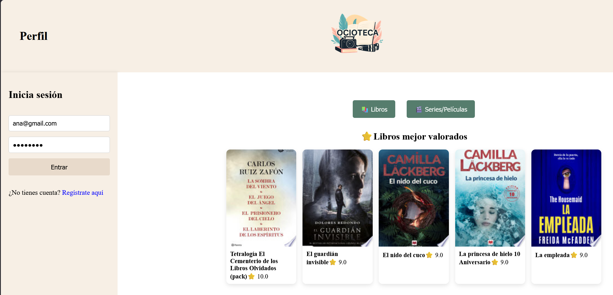
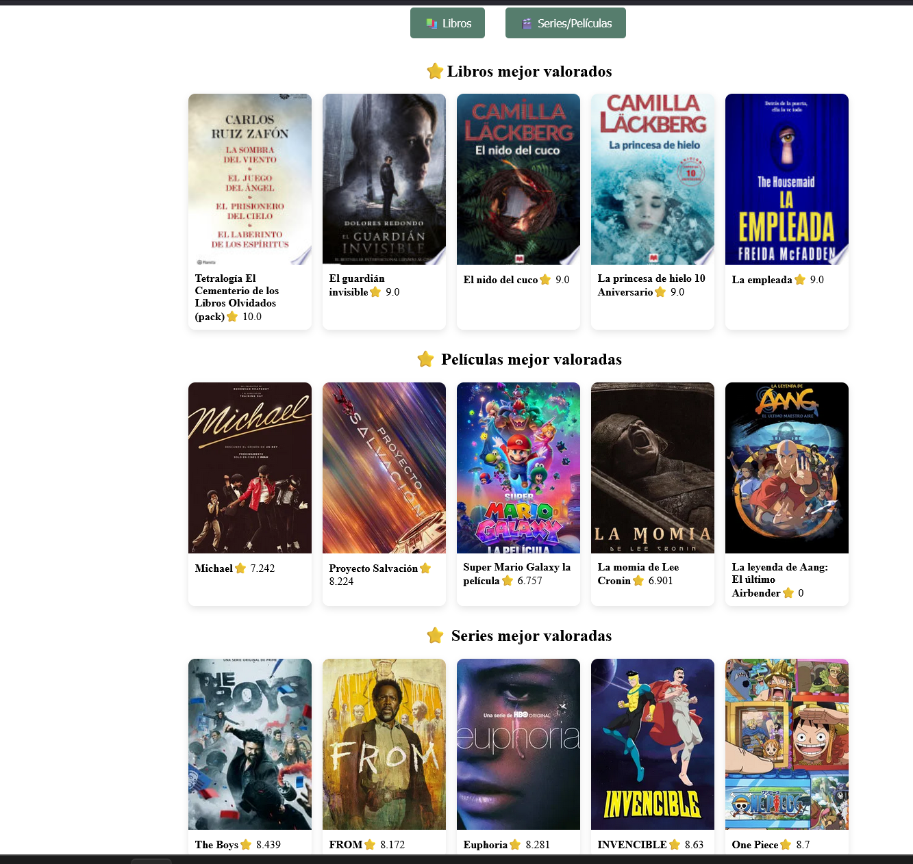
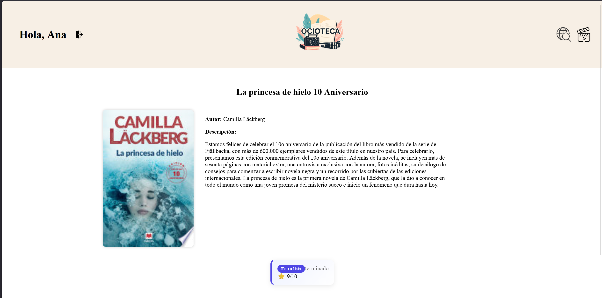
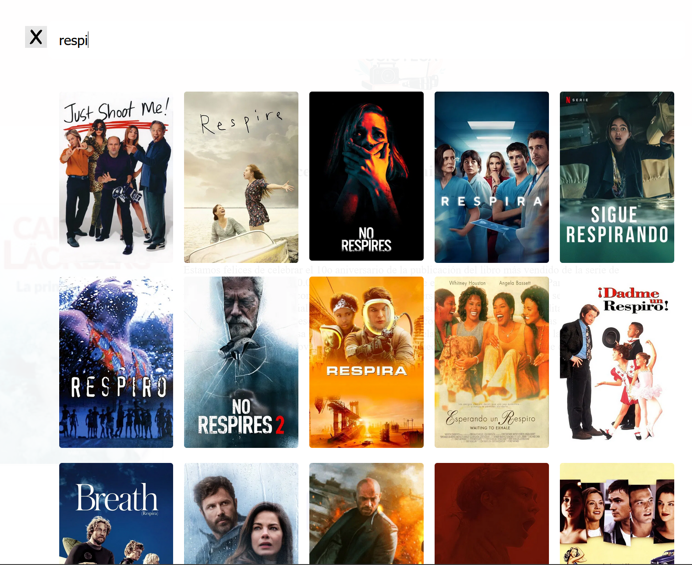

# 🎬📚 Ocioteca

Ocioteca es una aplicación full-stack que permite a los usuarios gestionar su consumo de contenido multimedia (libros, series y películas) en un único lugar.

Incluye autenticación de usuarios, seguimiento detallado del progreso (capítulos, temporadas y estado), sistema de valoraciones, reseñas y consumo de APIs externas en tiempo real.

Proyecto desarrollado aplicando buenas prácticas de arquitectura por capas, protección de credenciales y consumo seguro de APIs externas.

El proyecto simula un entorno real de desarrollo con arquitectura desacoplada frontend-backend y gestión segura de credenciales.

---

## 📸 Vista de la aplicación

### 🔐 Login



### 📊 Dashboard



### 📺 Gestión de progreso y reseñas



### 🔍 Búsqueda en tiempo real



---

## 🚀 ¿Qué problema resuelve?

Normalmente los usuarios necesitan utilizar distintas plataformas para:

* Buscar libros
* Consultar dónde ver series o películas
* Gestionar su progreso de consumo

Ocioteca unifica todo en una sola aplicación.

---

## ✨ Funcionalidades principales

* 🔍 Búsqueda en tiempo real de libros mediante Google Books
* 🎬 Búsqueda en tiempo real de series y películas mediante TMDB
* ⭐ Sistema de puntuación
* 📝 Sistema de reseñas de usuarios
* 📊 Gestión de estado del contenido:

  * Quiero ver / leer
  * Viendo / leyendo
  * Terminado
  * En espera
  * Abandonado
* 📺 Guardado de temporada y capítulo actual en series
* 📚 Enlace directo a Google Books para compra de libros
* 🎥 Visualización de plataformas de streaming disponibles (Netflix, etc.)
* 🔐 Sistema de autenticación (necesario para guardar progreso)

---

## 🧠 Conceptos técnicos clave

* Aplicación full-stack desacoplada (Angular + Spring Boot)
* Consumo de APIs externas en tiempo real
* Gestión de estado del usuario
* Arquitectura por capas en backend
* Persistencia de datos con MySQL
* Manejo seguro de API Keys
* Integración de base de datos relacional con consultas agregadas
* Manejo de estados personalizados por usuario
* Control de flujo entre frontend y backend mediante DTOs

---

## 🛠 Tecnologías utilizadas

### Frontend

* Angular
* TypeScript
* HTML / CSS
* Arquitectura basada en servicios
* Componentes standalone

### Backend

* Spring Boot
* API REST
* Arquitectura por capas (Controller / Service / Repository)

### Base de datos

* MySQL
* Gestión mediante HeidiSQL

### APIs externas

* TMDB (The Movie Database)
* Google Books

---

## 🔐 Seguridad

* Las API Keys nunca se exponen en el frontend
* El backend actúa como intermediario
* Uso de archivo de configuración ignorado por Git
* Ejemplo de configuración incluido (`application-example.properties`)
* Eliminación de archivos sensibles del repositorio mediante `.gitignore`
* Separación de configuración real y archivo de ejemplo
* Variables de entorno utilizadas en entorno de producción

---

## 🏗 Arquitectura

```
Frontend (Angular)
        ↓
Backend (Spring Boot - API REST)
        ↓
Base de Datos (MySQL)
        ↓
APIs externas (TMDB y Google Books)
```

El backend actúa como intermediario seguro entre el frontend y los servicios externos.

Las API Keys nunca son visibles en el navegador.

---

## ⚙️ Configuración del proyecto

Para ejecutar el proyecto en local:

1. Clonar el repositorio
2. Crear el archivo:

   ```
   src/main/resources/application.properties
   ```
3. Basarse en:

   ```
   application-example.properties
   ```
4. Configurar:

   * Base de datos MySQL
   * `google.books.key`
   * `tmdb.key`

> Las claves de API no están incluidas por motivos de seguridad.

---

## 📂 Estructura general

/Angular        → Aplicación frontend en Angular
/Spring boot    → Backend desarrollado con Spring Boot

---

## 📌 Estado del proyecto

Versión actual: MVP funcional completamente operativo con autenticación, persistencia de datos y consumo de APIs externas.

El proyecto está en continua mejora con futuras optimizaciones de rendimiento, experiencia de usuario y despliegue en producción.

---

## 👨‍💻 Autor

Proyecto desarrollado íntegramente por mí como aplicación full-stack para portfolio profesional.

---

## 📬 Contacto

Si deseas más información sobre el proyecto o su arquitectura, puedes contactarme a través de LinkedIn o GitHub.

Disponible para oportunidades como Desarrolladora Full-Stack / Backend Junior.


